<div align="center">

# 🧠 Brain Tumor Detection & Classification

### Automated MRI Analysis using Image Processing & Deep Learning

*Detect. Classify. Explain.*

---


---


</div>

---

## Overview

**Brain Tumor Detection & Classification** is a complete end-to-end image processing and deep learning pipeline that automatically analyzes brain MRI scans and classifies them into four categories. The project combines six classical image processing techniques with three machine learning models, achieving a final accuracy of **90.56%** using EfficientNetB0 transfer learning.

The pipeline does two things particularly well:

- 🔬 **Full image processing pipeline** — every MRI passes through Gaussian Blur, Histogram Equalization, Canny Edge Detection, Morphological Operations, Otsu Segmentation, and Contour Extraction before classification
- 🤖 **Transparent predictions** — a 7-step visual pipeline shows exactly what happens to the image at every stage before the final CNN prediction is made

---

## Tumor Classes

| Class | Description | CNN Accuracy |
|-------|-------------|:------------:|
| 🔴 **Glioma** | Fast-growing tumor in glial cells. Irregular shape, can appear anywhere in the brain. Hardest class to classify. | 73.5% |
| 🟣 **Meningioma** | Slow-growing tumor from the meninges. Typically circular, well-defined boundaries. | 90.0% |
| 🟢 **Pituitary** | Growth at the base of the brain. Fixed anatomical location makes it distinctive. | 99.0% |
| 🔵 **No Tumor** | Healthy brain scan. Symmetric regular structure — classified near-perfectly. | 99.75% |

---

## Sample MRI Images

<div align="center">

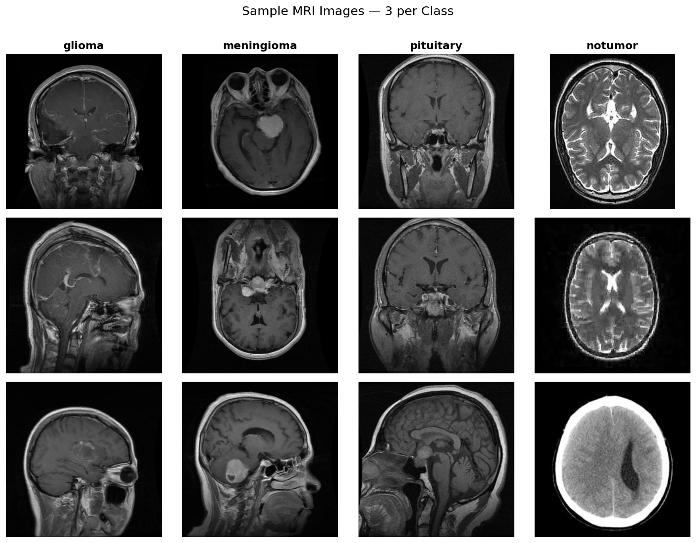
*3 sample MRI images per class — showing axial, coronal, and sagittal scan orientations*

</div>

---

## Image Processing Pipeline

Every MRI scan goes through **6 processing stages** before classification:

```
Raw MRI  →  Gaussian Blur  →  Histogram EQ  →  Edge Detection
         →  Morphological Ops  →  Segmentation  →  Contour Extraction  →  CNN
```

### Step 1 & 2 — Gaussian Blur + Histogram Equalization

> **Gaussian Blur** (5×5 kernel): Reduces MRI scanner noise while preserving tissue boundaries.
> **Histogram Equalization** (Y-channel, YCrCb): Redistributes pixel intensities to improve contrast between tumor tissue and surrounding brain matter.

<div align="center">

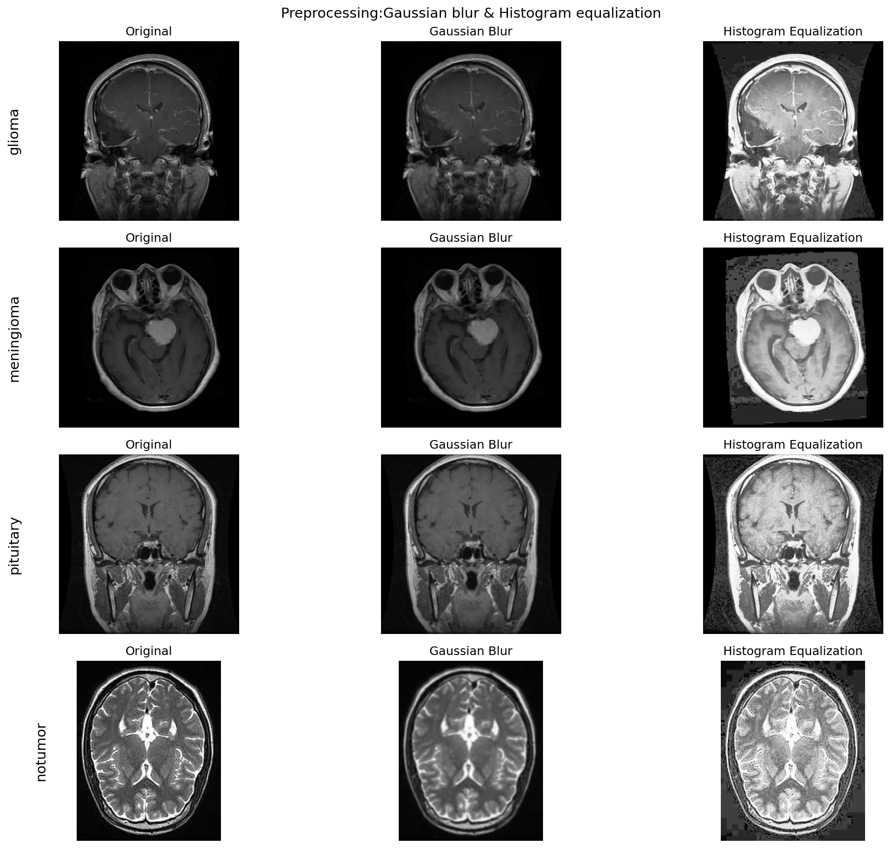
*Original → Gaussian Blur → Histogram Equalization for all four classes*

</div>

The pixel intensity histograms confirm that equalization spreads the heavily left-skewed distribution into a more uniform range:

<div align="center">

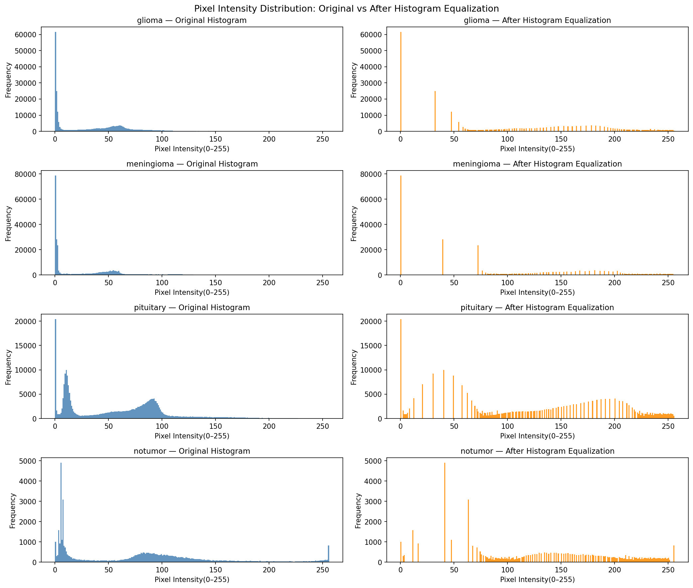
*Pixel intensity distributions — Original (blue) vs After Histogram Equalization (orange)*

</div>

---

### Step 3 — Canny Edge Detection

> A multi-stage algorithm that finds tissue-tumor boundaries, skull outline, and anatomical structures.
> Pre-blur: 3×3 Gaussian | Thresholds: low=50, high=150

<div align="center">

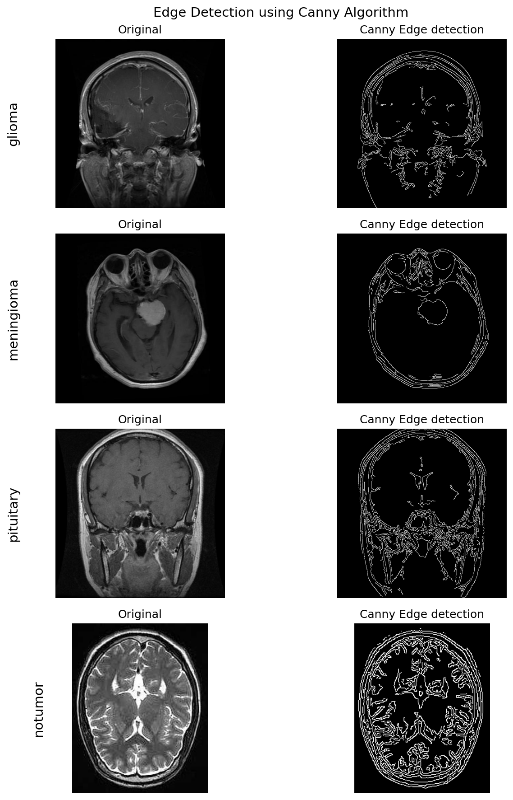
*Original vs Canny edge maps — each class shows a distinctive edge signature*

</div>

| Class | Edge Pattern |
|-------|-------------|
| Glioma | Scattered, irregular — reflects the diffuse nature of the tumor |
| Meningioma | Clean circular edge clearly visible around the tumor mass |
| Pituitary | Structured edges around the sella region at the brain base |
| No Tumor | Dense, uniform brain gyri edges — no abnormal mass boundaries |

---

### Step 4 — Morphological Operations

> Four operations using a 5×5 elliptical structuring element to clean binary masks.

<div align="center">

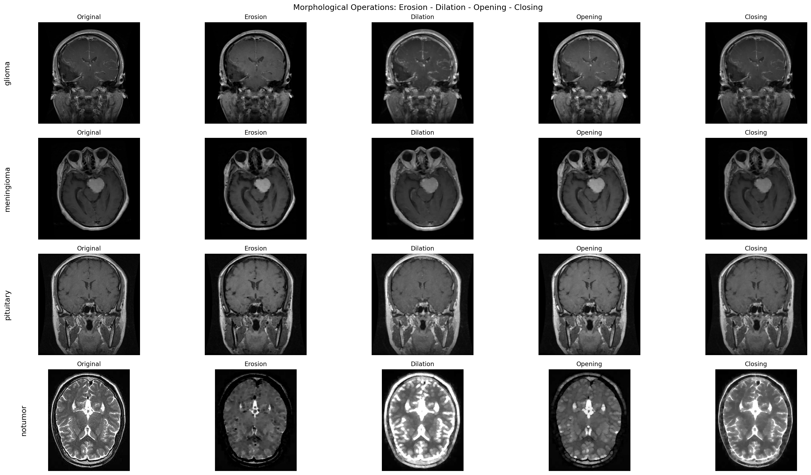
*Original → Erosion → Dilation → Opening → Closing for all four classes*

</div>

| Operation | Effect |
|-----------|--------|
| **Erosion** | Shrinks bright regions, removes thin noise protrusions |
| **Dilation** | Expands bright regions, fills small holes and gaps |
| **Opening** | Erosion → Dilation: removes small noise blobs from background |
| **Closing** | Dilation → Erosion: fills internal holes in foreground regions |

---

### Step 5 — Tumor Segmentation

> **Pipeline:** Otsu Thresholding → Morphological Opening (2 iterations) → Contour Area Filtering
> The largest contour (skull/brain outline) is skipped. Only contours between **1%–30%** of the largest area are kept as tumor candidates.

<div align="center">

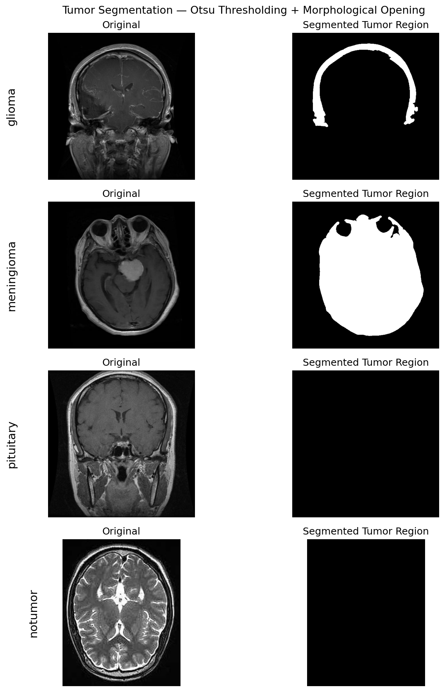
*Original MRI vs Segmented Tumor Mask — Otsu thresholding + morphological opening*

</div>

---

### Step 6 — Contour Extraction & Visualization

> Detected tumor boundaries drawn directly on the original MRI.
> 🟢 **Green line** = tumor contour boundary | 🔵 **Blue rectangle** = bounding box

<div align="center">

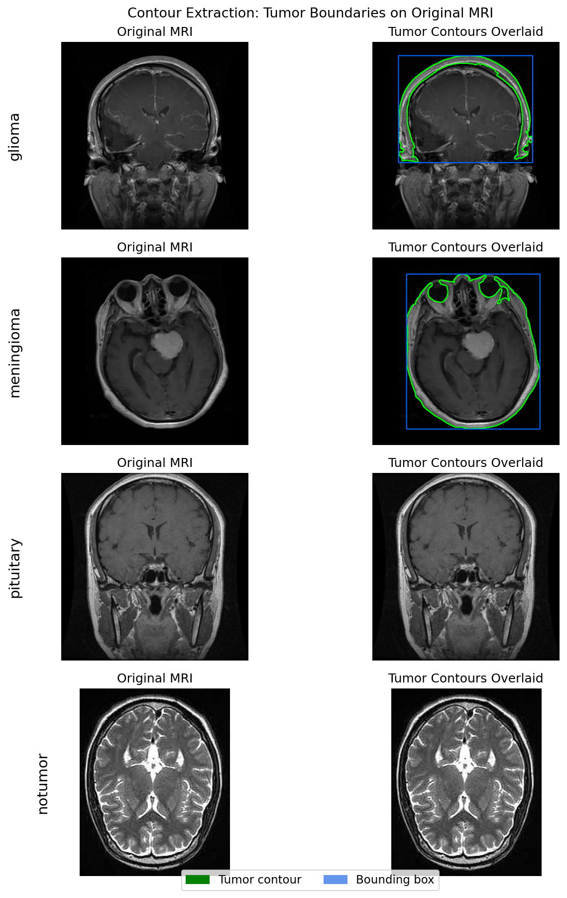
*Tumor contours overlaid on original MRI scans for all four classes*

</div>

---

## Feature Extraction

For **Random Forest** and **XGBoost**, 8 numerical features are extracted per image:

**Shape Features** (from contour):

| Feature | Description |
|---------|-------------|
| Area | Total pixels within the largest detected contour |
| Perimeter | Boundary length — irregular tumors have larger perimeters |
| Aspect Ratio | Bounding box W/H — values near 1.0 = circular shape |
| Circularity | 4π×Area / Perimeter² — meningiomas score highest |

**Intensity Features** (from pixels inside mask):

| Feature | Description |
|---------|-------------|
| Mean Intensity | Average pixel brightness within the tumor region |
| Std Deviation | Spread of intensities — high = heterogeneous tissue |
| Min Intensity | Darkest pixel in the segmented region |
| Max Intensity | Brightest pixel in the segmented region |

All 5,600 training images are processed and features saved to `outputs/09_feature_tables/all_features.csv`.

---

## Classification Models

### Model Comparison

<div align="center">

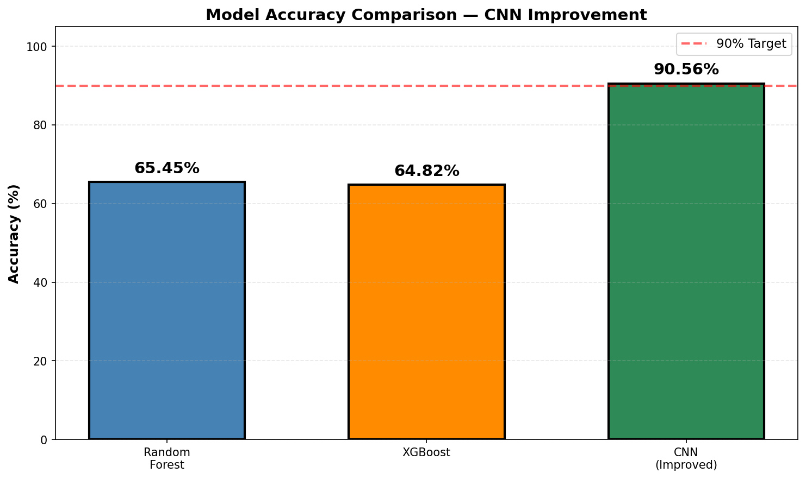
*Accuracy comparison — EfficientNetB0 reaches 90.56%, exceeding the 90% target*

</div>

| Model | Training Data | Test Images | Accuracy | Notes |
|-------|:-------------:|:-----------:|:--------:|-------|
| Random Forest | 4,480 (features) | 1,120 | 65.45% | 200 trees, 8 hand-crafted features |
| XGBoost | 4,480 (features) | 1,120 | 64.82% | 200 estimators, same feature set |
| CNN (Original) | 5,600 (128×128) | 1,600 | 77.00% | 3× Conv2D, 10 epochs |
| **CNN + EfficientNetB0** | **5,600 (224×224)** | **1,600** | **90.56%** | **Transfer learning, 2-phase training** |

---

### EfficientNetB0 — Architecture

```
EfficientNetB0 (ImageNet pre-trained weights)
        ↓
GlobalAveragePooling2D
        ↓
BatchNormalization
        ↓
Dense(256, relu)  →  Dropout(0.4)
        ↓
Dense(128, relu)  →  Dropout(0.3)
        ↓
Dense(4, softmax)   ← Glioma | Meningioma | Pituitary | No Tumor
```

**Two-phase training:**

| Phase | Base Layers | Learning Rate | Epochs | Purpose |
|-------|:-----------:|:-------------:|:------:|---------|
| Phase 1 | ❄️ Frozen | `1e-3` | 15 | Train top classifier layers only |
| Phase 2 | 🔓 Top 50 unfrozen | `1e-4` | 20 | Fine-tune on MRI data |

**Callbacks:** `EarlyStopping(patience=6)` + `ReduceLROnPlateau(factor=0.3, patience=3)`

> ⚠️ **Critical Fix:** Initial accuracy was stuck at **37%** because the data generator used `rescale=1./255` instead of `preprocess_input`. EfficientNetB0 requires its own pixel normalization. After fixing to `preprocessing_function=preprocess_input`, accuracy jumped to **90.56%**.

---

## Results

### Training Curves

<div align="center">

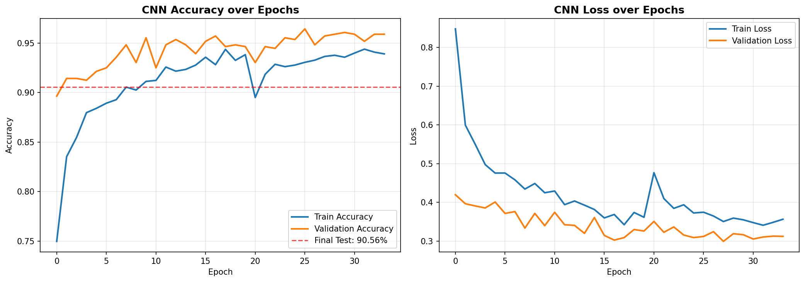
*CNN accuracy and loss over all training epochs — stable convergence to 90.56% final test accuracy*

</div>

### Confusion Matrix

<div align="center">

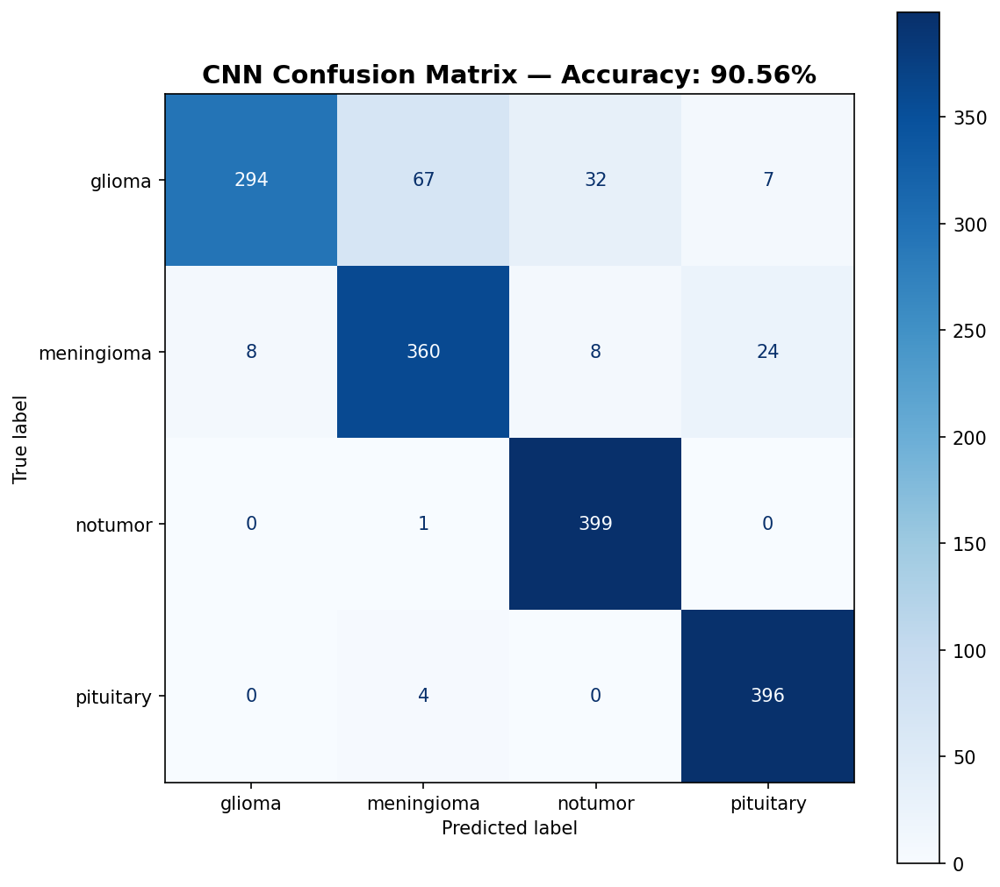
*CNN confusion matrix — 1,600 test images — Overall accuracy: 90.56%*

</div>

### Per-Class Breakdown

| Class | Correct | Total | Accuracy | Main Confusion |
|-------|:-------:|:-----:|:--------:|----------------|
| 🔵 No Tumor | 399 | 400 | **99.75%** | — |
| 🟢 Pituitary | 396 | 400 | **99.0%** | — |
| 🟣 Meningioma | 360 | 400 | **90.0%** | 24 confused with Pituitary |
| 🔴 Glioma | 294 | 400 | **73.5%** | 67 confused with Meningioma |

---

## Prediction Pipeline Visualization

Full 7-step pipeline for each test image:

`Original → Blur → Histogram EQ → Edge Detection → Segmentation → Contours → CNN Prediction`

<div align="center">

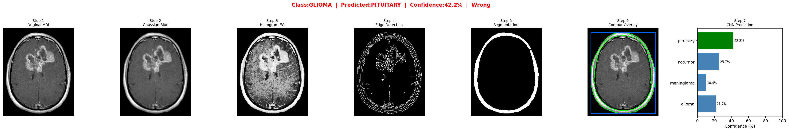
*🔴 Glioma — Predicted: PITUITARY ✗ (42.2%) — Low confidence reflects genuine ambiguity*

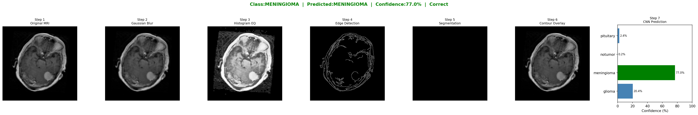
*🟣 Meningioma — Predicted: MENINGIOMA ✓ (77.0%) — Correct despite imperfect segmentation*

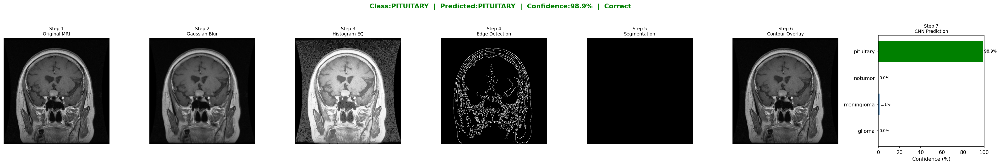
*🟢 Pituitary — Predicted: PITUITARY ✓ (98.9%) — Very high confidence*

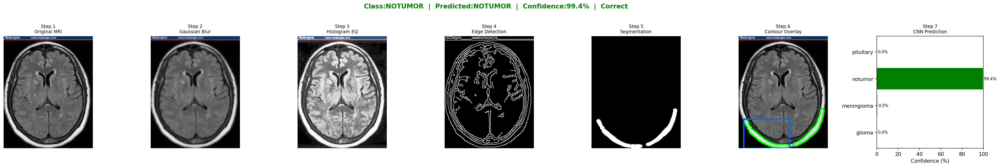
*🔵 No Tumor — Predicted: NOTUMOR ✓ (99.4%) — Near-perfect, distinctive healthy structure*

</div>

### Batch Predictions — 3 Samples per Class

<div align="center">

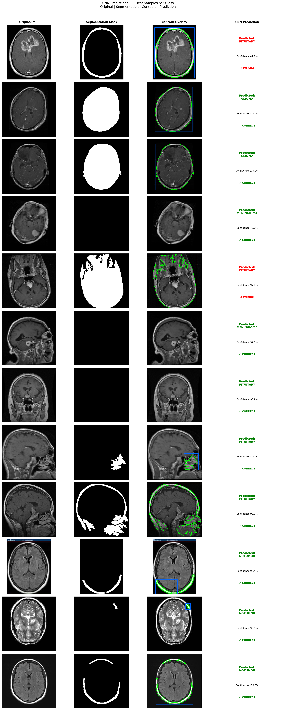
*12 test images — Original | Segmentation Mask | Contour Overlay | CNN Prediction*

</div>

---

## Project Structure

```
Brain-Tumor-Detection/
│
├── Brain_Tumor_Detection_Final.ipynb    ← Main notebook
│
├── data/
│   ├── Training/
│   │   ├── glioma/         (1,400 images)
│   │   ├── meningioma/     (1,400 images)
│   │   ├── pituitary/      (1,400 images)
│   │   └── notumor/        (1,400 images)
│   └── Testing/
│       ├── glioma/         (400 images)
│       ├── meningioma/     (400 images)
│       ├── pituitary/      (400 images)
│       └── notumor/        (400 images)
│
└── outputs/
    ├── 01_sample_images/
    ├── 02_gaussian_blur/
    ├── 03_histogram_equalization/
    ├── 04_intensity_histograms/
    ├── 05_edge_detection/
    ├── 06_morphological_ops/
    ├── 07_segmentation/
    ├── 08_contour_visualization/
    ├── 09_feature_tables/           ← all_features.csv
    ├── 10_model_results/            ← confusion matrix, curves, reports
    └── 11_predictions/              ← pipeline visualizations
```

---

## Setup & Installation

```bash
# Clone the repository
git clone https://github.com/Nasrullah-Hafeel/Brain-Tumor-Detection.git
cd Brain-Tumor-Detection

# Install dependencies
pip install tensorflow opencv-python scikit-learn xgboost matplotlib pandas numpy Pillow

# Launch notebook
jupyter notebook Brain_Tumor_Detection_Final.ipynb
```

**Requirements:**
```
tensorflow>=2.10
opencv-python>=4.7
scikit-learn>=1.2
xgboost>=1.7
matplotlib>=3.6
pandas>=1.5
numpy>=1.23
Pillow>=9.4
```

> **Note:** Update `BASE_DIR` in Cell 2 to your local dataset path before running.

---

## Key Findings

- **Transfer learning beats hand-crafted features** by 25 percentage points (90.56% vs 65.45%)
- **Location-based classes are easiest** — No Tumor and Pituitary have distinctive spatial signatures the model learns immediately
- **Glioma is the hardest class** (73.5%) — diffuse, irregular, no consistent visual pattern
- **CNN is resilient to segmentation failures** — it classifies from raw pixels, not from the mask
- **Wrong preprocessing = 37% accuracy** — `rescale=1./255` with EfficientNet causes complete failure

---

## Dataset

**Brain Tumor MRI Dataset** — available on Kaggle

- 7,200 total images (5,600 training + 1,600 testing)
- Balanced — 1,400 training and 400 testing per class
- MRI types: Axial, Coronal, Sagittal views
- 📎 [Brain Tumor MRI Dataset — Kaggle](https://www.kaggle.com/datasets/masoudnickparvar/brain-tumor-mri-dataset)

---

## License

This project is licensed under the **MIT License** — see the [LICENSE](LICENSE) file for details.

---

<div align="center">

**M.H.Nasrullah**
HND in Computer Science with Artificial Intelligence
NIBM — The City University · KIC-HNDCSAI-252F-031

[](https://github.com/Nasrullah-Hafeel)

*If this project helped you, please consider giving it a ⭐*

</div>
